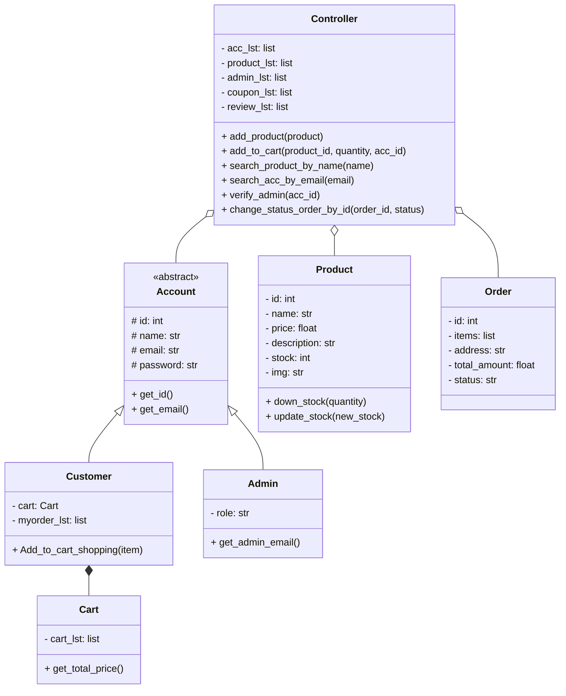
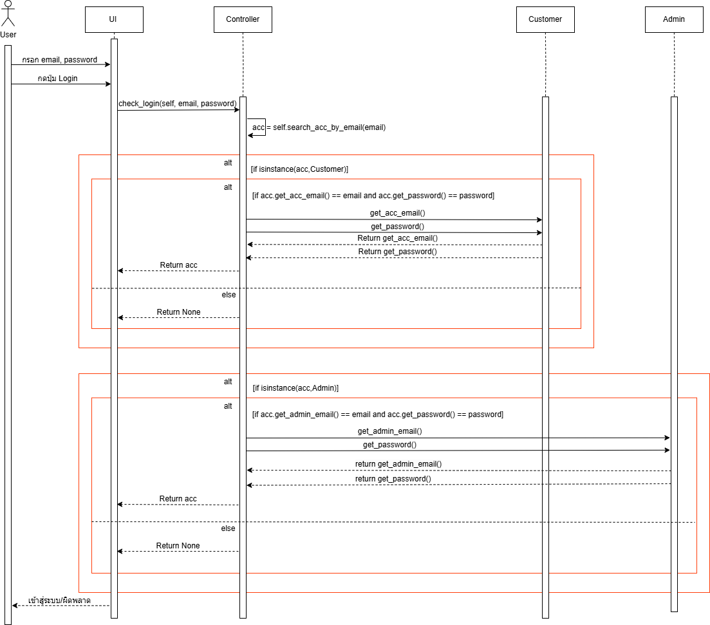
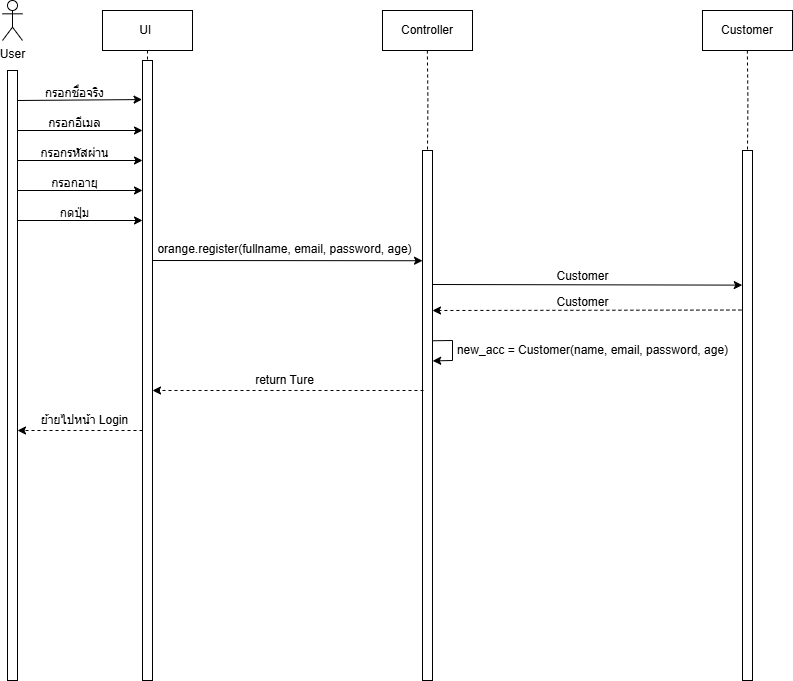
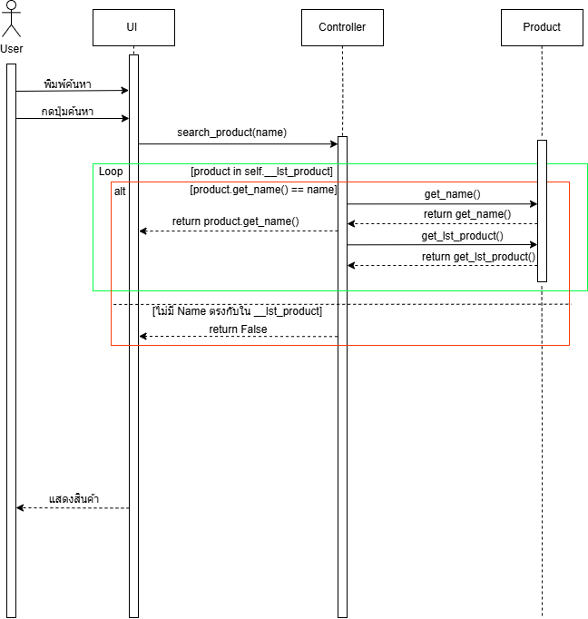
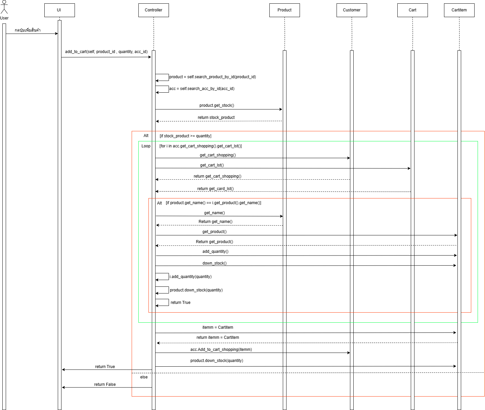
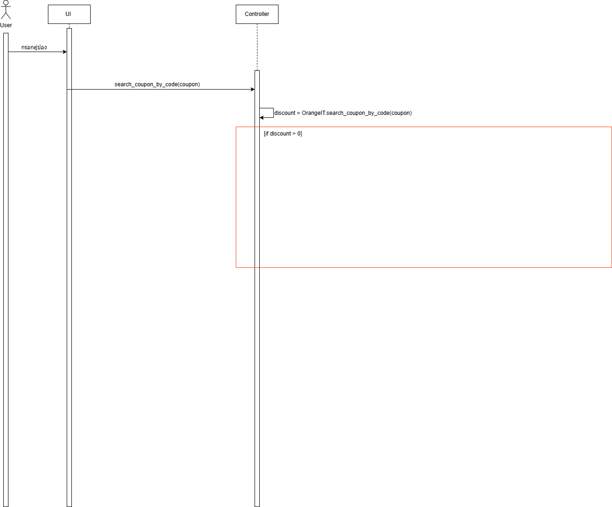
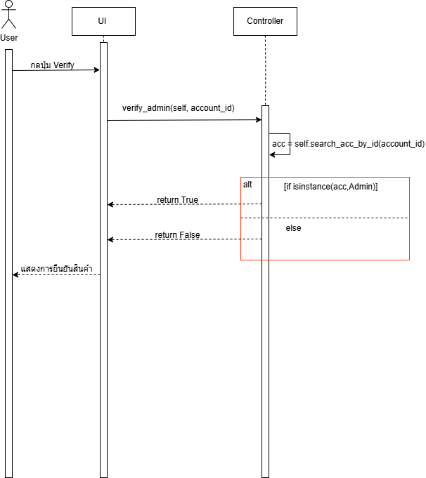

# 🛒 OrangeIT - Object-Oriented E-Commerce Web Application

[](https://www.python.org/)
[](https://fastht.ml/)
[](https://picocss.com/)
[]()

> A full-stack, responsive e-commerce web platform engineered in Python using **FastHTML** and **Object-Oriented Programming (OOP)** principles. Developed as the capstone assignment for the Year 1 Object-Oriented Programming coursework.

---

## 🌟 Key Features

### 👤 User Authentication & Roles
- **Customer & Admin Roles**: Role-based access control with inheritance from account domain models.
- **Registration & Login**: Secure account verification and active session tracking.
- **Admin Verification**: Privileged administrative routes protected against unauthorized access.

### 🛍️ Product Catalog & Interactive Search
- **Instant Search**: Real-time product search with HTMX debounced input (`keyup delay:500ms`).
- **Product Detail Views**: Dynamic pricing, rich descriptions, stock levels, and customer ratings.
- **Review System**: Verified customer reviews with star ratings and feedback comments.

### 🛒 Cart & Order Management
- **Smart Shopping Cart**: Real-time quantity adjustments, stock decrement validation, and cart persistence.
- **Coupon System**: Code-based discount redemption with validation and total amount calculations.
- **Order Processing**: Multi-state order lifecycle (`Pending Verification` -> `Accept Order` / `Reject Order`).

### 🛠️ Admin Dashboard
- **Product Management**: Add new products with file upload handling (`PIC` directory), edit pricing, update stock levels, and delete products.
- **Order Verification**: Review submitted customer orders, delivery addresses, and payment receipts with one-click approval/rejection.

---

## 📐 Object-Oriented Architecture

The application strictly implements core OOP principles:



### OOP Principles Breakdown:
1. **Encapsulation**:
   - Internal states (`__acc_lst`, `__product_lst`, `__stock`, `__price`) are strictly private with controlled getters, setters, and mutation methods (`down_stock`, `update_product`).
2. **Inheritance & Polymorphism**:
   - Base account attributes and behaviors are inherited by `Customer` and `Admin`, providing clean role differentiation and polymorphic credential checks.
3. **Controller / Facade Pattern**:
   - The `Controller` class acts as the centralized system coordinator handling cross-domain logic (cart additions, order verification, inventory updates).
4. **Separation of Concerns**:
   - Application logic is cleanly decoupled into domain models (`make_app/`), modular HTTP route controllers (`route/`), and custom presentation styles (`css.py`).

---

## 📊 Sequence Diagrams

The system workflow is documented with formal sequence diagrams:

| Feature | Sequence Diagram |
| :--- | :--- |
| **User Login** |  |
| **Registration** |  |
| **Product Search** |  |
| **Add to Cart** |  |
| **Checkout & Coupon** |  |
| **Confirm Payment** |  |
| **Admin Add Product** |  |
| **Admin Verification** |  |

*(Editable XML source files available in [`docs/diagrams/`](docs/diagrams/))*

---

## 📁 Project Structure

```
01-OrangeIT-Ecommerce/
├── app.py                      # Application entry point & FastHTML app instance
├── config.py                   # Session variables & upload configurations
├── requirements.txt            # Project dependencies
├── make_app/                   # Domain Models & Styling
│   ├── __init__.py
│   ├── class_orangeit.py       # OOP Domain Classes (Controller, Product, Customer, etc.)
│   ├── create_instance.py      # Seed data & instance initialization
│   └── css.py                  # Custom Pico CSS styles
├── route/                      # Modular Route Controllers
│   ├── __init__.py
│   ├── authen_route.py         # Login, Register, Logout
│   ├── home_route.py           # Home view, Product catalog, Real-time search
│   ├── product_route.py        # Product detail, Buy now, Product reviews
│   ├── member_route.py         # Cart management, Checkout, Payment confirmation
│   └── admin_route.py          # Dashboard, Product management, Order approvals
├── PIC/                        # Static product assets & icons
├── p/                          # Static mirror for FastHTML dynamic routes
│   └── PIC/
├── data/                       # Reference catalog data
│   └── Product_Detail.txt
└── docs/                       # Architecture & Sequence Diagrams
    └── diagrams/               # .drawio and .png diagrams
```

---

## 🚀 Getting Started

### 1. Prerequisites
- Python 3.10+
- `pip` package manager

### 2. Installation
Navigate into the project directory and install dependencies:
```bash
cd "01-OrangeIT-Ecommerce"
pip install -r requirements.txt
```

### 3. Run Application
Start the server:
```bash
python app.py
```
Open your browser and navigate to:
```
http://localhost:5001
```

---

## 🔑 Demo Credentials

Pre-configured accounts for testing:

| Role | Email | Password | Permissions |
| :--- | :--- | :--- | :--- |
| **Administrator** | `admin@gmail.com` | `1234` | Full access to Admin Dashboard, Product creation/editing, and Order verification |
| **Customer** | `MAX@gmail.com` | `111` | Browsing, Cart, Checkout, Reviews, Order tracking |
| **Customer** | `JJ@gmail.com` | `2222` | Standard shopping experience |

---

## 👥 Contributors
- **67015155** - Atichanan Jantamit
- **67015105**
- **67015167**
Department of Computer Engineering (Cont.)
