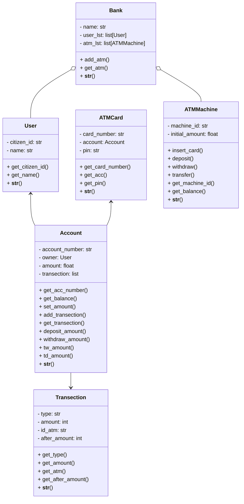

```mermaid
    classDiagram
    class User {
        - citizen_id: str
        - name: str
        + get_citizen_id()
        + get_name()
        + __str__()
    }

    class Account {
        - account_number: str
        - owner: User
        - amount: float
        - transection: list
        + get_acc_number()
        + get_balance()
        + set_amount()
        + add_transection()
        + get_transection()
        + deposit_amount()
        + withdraw_amount()
        + tw_amount()
        + td_amount()
        + __str__()
    }

    class ATMCard {
        - card_number: str
        - account: Account
        - pin: str
        + get_card_number()
        + get_acc()
        + get_pin()
        + __str__()
    }

    class ATMMachine {
        - machine_id: str
        - initial_amount: float
        + insert_card()
        + deposit()
        + withdraw()
        + transfer()
        + get_machine_id()
        + get_balance()
        + __str__()
    }

    class Bank {
        - name: str
        - user_lst: list[User]
        - atm_lst: list[ATMMachine]
        + add_atm()
        + get_atm()
        + __str__()
    }

    class Transection {
        - type: str
        - amount: int
        - id_atm: str
        - after_amount: int
        + get_type()
        + get_amount()
        + get_atm()
        + get_after_amount()
        + __str__()
    }

    User <-- Account 
    Account --> Transection 
    ATMCard <-- Account 
    Bank o-- ATMMachine 
    Bank o-- User 
```