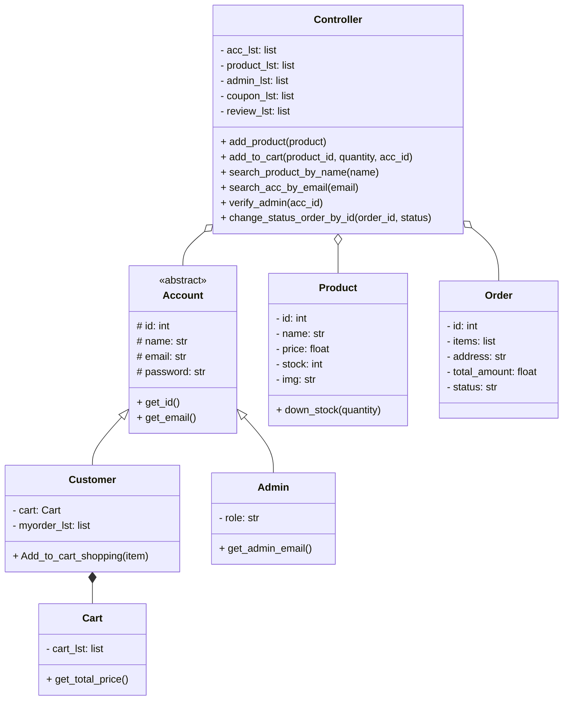

# 🚀 Object-Oriented Programming (OOP) - Portfolio & Capstone Project

[](https://www.python.org/)
[](https://fastht.ml/)
[](https://picocss.com/)
[](https://app.diagrams.net/)
[](LICENSE)

> A comprehensive portfolio of **Object-Oriented Programming (OOP)** coursework, laboratory assignments, system design architectures, and full-stack software development in Python.
> 
> **Author**: Atichanan Jantamit (อธิชนัน จันทมิตร)  
> **Affiliation**: Department of Computer Engineering (Cont.)  
> **Course**: Object-Oriented Programming (Year 1)

---

## 📑 Table of Contents
- [🌟 Flagship Project: OrangeIT E-Commerce](#-flagship-project-orangeit-e-commerce)
  - [System Highlights](#system-highlights)
  - [Domain Architecture & Class Diagram](#domain-architecture--class-diagram)
  - [System Sequence Diagrams](#system-sequence-diagrams)
  - [Quick Start Guide](#quick-start-guide)
  - [Demo Accounts](#demo-accounts)
- [📂 Repository Structure](#-repository-structure)
- [🧪 Laboratory Assignments](#-laboratory-assignments)
- [💡 OOP Practice Problems](#-oop-practice-problems)
- [⚡ FastHTML Learning Lab](#-fasthtml-learning-lab)
- [📝 Practical Exam Solutions](#-practical-exam-solutions)
- [🛠️ Technical Skills & Competencies](#️-technical-skills--competencies)

---

## 🌟 Flagship Project: OrangeIT E-Commerce

> 📁 Location: [`01-OrangeIT-Ecommerce/`](01-OrangeIT-Ecommerce/)  
> 📖 Detailed Documentation: [Read the OrangeIT README](01-OrangeIT-Ecommerce/README.md)

**OrangeIT** is an end-to-end e-commerce web platform engineered with **FastHTML**, **HTMX**, and pure **Object-Oriented Design Patterns**. It models realistic retail business operations including role-based access control, catalog management, shopping cart operations, coupon discounts, and order verification.

### System Highlights
- 🔐 **Role-Based Authentication**: Distinct customer and admin workflows using class inheritance.
- ⚡ **Instant Search & Dynamic Filter**: HTMX debounced product search (`keyup delay:500ms`) with zero heavy client frameworks.
- 🛒 **Inventory & Cart Management**: Real-time stock validation, atomic stock decrements, and cart calculations.
- 🎟️ **Coupon & Pricing Engine**: Code-based discount application and total recalculation.
- 📦 **Order Processing Lifecycle**: Multi-stage order status tracking (`Pending Verification` -> `Accept Order` / `Reject Order`).
- 🛠️ **Administrative Control Panel**: Interactive dashboard to add products with image upload, modify pricing, manage inventory, and verify incoming orders.

### Domain Architecture & Class Diagram

The application implements a decoupled **Controller / Facade** pattern to orchestrate domain models:



### System Sequence Diagrams
System interactions are thoroughly modeled with sequence diagrams:

| Feature Workflow | Diagram Link |
| :--- | :--- |
| **Authentication & Login** | [`docs/diagrams/Login.drawio.png`](01-OrangeIT-Ecommerce/docs/diagrams/Login.drawio.png) |
| **User Registration** | [`docs/diagrams/register.drawio.png`](01-OrangeIT-Ecommerce/docs/diagrams/register.drawio.png) |
| **Product Search** | [`docs/diagrams/Search.drawio.png`](01-OrangeIT-Ecommerce/docs/diagrams/Search.drawio.png) |
| **Add Product to Cart** | [`docs/diagrams/add_to_cart.drawio.png`](01-OrangeIT-Ecommerce/docs/diagrams/add_to_cart.drawio.png) |
| **Checkout & Apply Coupon** | [`docs/diagrams/check_out_and_coupon.drawio.png`](01-OrangeIT-Ecommerce/docs/diagrams/check_out_and_coupon.drawio.png) |
| **Confirm Payment** | [`docs/diagrams/confirm_payment.drawio.png`](01-OrangeIT-Ecommerce/docs/diagrams/confirm_payment.drawio.png) |
| **Admin Add Product** | [`docs/diagrams/add_product.drawio.png`](01-OrangeIT-Ecommerce/docs/diagrams/add_product.drawio.png) |
| **Verify Admin Permissions** | [`docs/diagrams/Verify_admin.drawio.png`](01-OrangeIT-Ecommerce/docs/diagrams/Verify_admin.drawio.png) |

### Quick Start Guide

```bash
# 1. Clone repository
git clone https://github.com/<your-username>/<repo-name>.git
cd <repo-name>

# 2. Install dependencies
pip install -r requirements.txt

# 3. Launch OrangeIT E-Commerce
cd 01-OrangeIT-Ecommerce
python app.py
```
*Application runs at: `http://localhost:5001`*

### Demo Accounts

| Role | Username / Email | Password | Access Level |
| :--- | :--- | :--- | :--- |
| **Admin** | `admin@gmail.com` | `1234` | Full Dashboard & Catalog Management |
| **Customer 1** | `MAX@gmail.com` | `111` | Standard Customer & Shopping Cart |
| **Customer 2** | `JJ@gmail.com` | `2222` | Standard Customer & Shopping Cart |

---

## 📂 Repository Structure

```
├── 01-OrangeIT-Ecommerce/       # 🛒 Capstone E-Commerce Platform
│   ├── app.py                   # Server entrypoint
│   ├── config.py                # Session & path configurations
│   ├── make_app/                # Domain models, controller & CSS
│   ├── route/                   # Modular route controllers (Admin, Authen, Home, Cart, Product)
│   ├── docs/diagrams/           # UML Sequence Diagrams (.drawio & .png)
│   ├── PIC/ & p/PIC/            # Static image assets
│   ├── data/                    # Seed product dataset
│   └── README.md                # Project documentation
│
├── 02-Labs/                     # 🧪 Coursework Laboratory Exercises
│   ├── Lab01-RPG-Character/     # Object Composition & Aggregation
│   ├── Lab02-Course-Registration/ # Encapsulation, Validation & Properties
│   ├── Lab03-ATM-Banking-System/  # Financial Transactions & ATM UML Modeling
│   └── README.md
│
├── 03-Practices/                # 💡 Design Problems & OOP Principles
│   ├── Bank_Encap.py            # Encapsulation & Data Integrity
│   ├── Hotel.py                 # Hotel Booking & Room Allocation
│   ├── coffee_shop.py           # POS Order Aggregation
│   ├── Product_Catalog_Search.py# Product lookup & case-insensitive matching
│   └── README.md
│
├── 04-FastHTML-Learning/        # ⚡ 34 FastHTML & HTMX Progressive Tutorials
│   ├── 1_fast_html_*.py         # Fundamentals & Routing
│   ├── 2_fast_html_pico*.py     # Pico CSS Integration & Grid Layouts
│   ├── 3_fast_html_form*.py     # Forms & Typed Payload Handling
│   ├── 4_fast_html_http_*.py    # REST Verbs & Handlers
│   ├── 5_fast_html_ajax_*.py    # HTMX Real-Time AJAX Components
│   ├── sport_complex.py, todo.py# Interactive Mini Applications
│   └── README.md
│
├── 05-Exams/                    # 📝 Examination Problem Solutions
│   ├── Appointment_Scheduler.py # Multi-party Recurring Event System
│   └── README.md
│
├── .gitignore                   # Production-grade Git ignore file
├── requirements.txt             # Global dependencies
└── README.md                    # Portfolio master README
```

---

## 🧪 Laboratory Assignments

1. **[Lab 01: RPG Character Simulation](02-Labs/Lab01-RPG-Character/)**:  
   Focuses on composition and aggregation by building player characters equipped with upgradable weapons, armor, and clan guild affiliations.
2. **[Lab 02: University Course Registration](02-Labs/Lab02-Course-Registration/)**:  
   Demonstrates data encapsulation, property getters/setters (`@property`, `@setter`), and bidirectional relationships between students, courses, and faculties.
3. **[Lab 03: ATM Banking System](02-Labs/Lab03-ATM-Banking-System/)**:  
   Architected around formal UML Class Diagrams with complete ATM simulation: PIN authorization, balance inquiries, deposit/withdrawal transaction logs, and inter-account transfers.

---

## 💡 OOP Practice Problems

A curated suite of OOP problem statements located in [`03-Practices/`](03-Practices/):
- **Encapsulation & Security**: [`Bank_Encap.py`](03-Practices/Bank_Encap.py) ensures balance state cannot be altered without passing through withdrawal validation rules.
- **Entity Modeling**: [`Hotel.py`](03-Practices/Hotel.py), [`coffee_shop.py`](03-Practices/coffee_shop.py), and [`Car.py`](03-Practices/Car.py) simulate realistic business workflows.
- **Search & Collections**: [`Product_Catalog_Search.py`](03-Practices/Product_Catalog_Search.py) provides search utility patterns.

---

## ⚡ FastHTML Learning Lab

A complete set of 34 progressive code samples located in [`04-FastHTML-Learning/`](04-FastHTML-Learning/):
- Zero-build full-stack Python development.
- Server-Driven UI utilizing **HTMX** for smooth single-page application (SPA) user experiences without writing complex JavaScript.
- Semantic and lightweight component layouts with **Pico CSS**.

---

## 📝 Practical Exam Solutions

Located in [`05-Exams/`](05-Exams/):
- **[Appointment Scheduler](05-Exams/Appointment_Scheduler.py)**: An automated event and meeting management system supporting single date schedules, weekly recurring meetings, member notifications via SMS dispatchers, and polymorphic event filtering.

---

## 🛠️ Technical Skills & Competencies

| Category | Skills & Technologies |
| :--- | :--- |
| **Core Language** | Python 3.10+ |
| **OOP Principles** | Encapsulation, Inheritance, Polymorphism, Abstraction, Composition, Aggregation |
| **Design Patterns** | Controller / Facade Pattern, Model-View-Controller (MVC), Property Decorators |
| **Web & Frameworks** | FastHTML, HTMX, Starlette, ASGI (Uvicorn), Pico CSS |
| **Modeling & Architecture** | UML Class Diagrams, Sequence Diagrams, Draw.io, Mermaid.js |
| **Dev Tools** | Git, GitHub, Python Virtual Environments (`venv`) |

---

## 📜 License
This project is open-source and available under the [MIT License](LICENSE).
